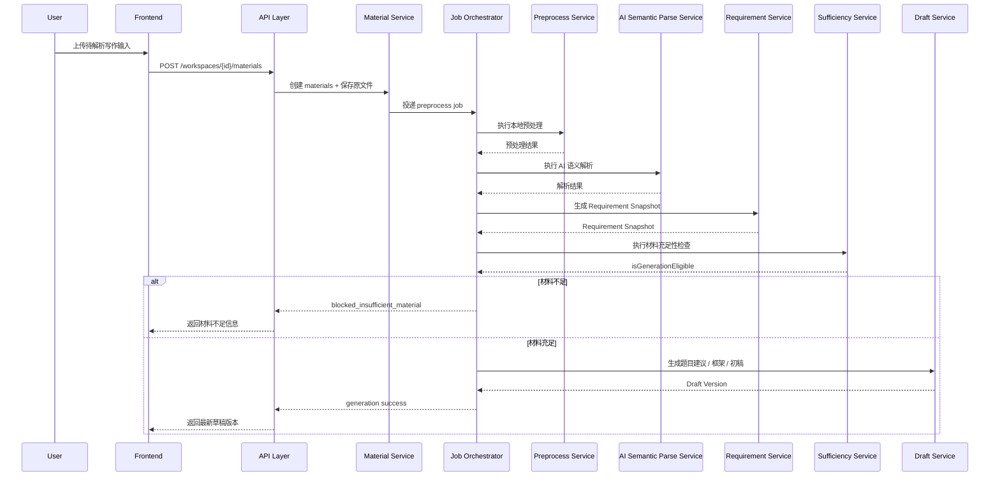
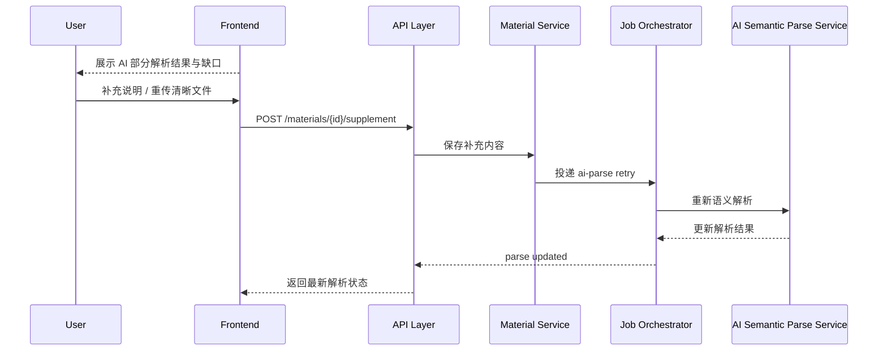
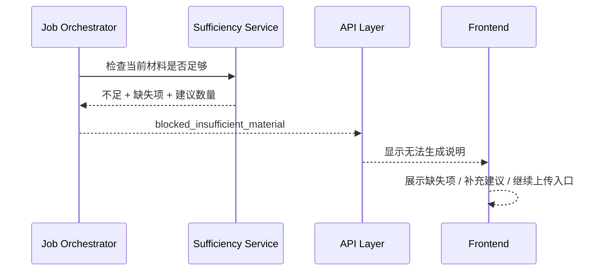
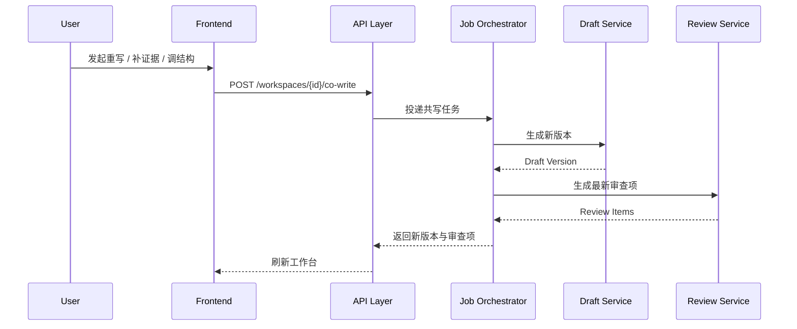
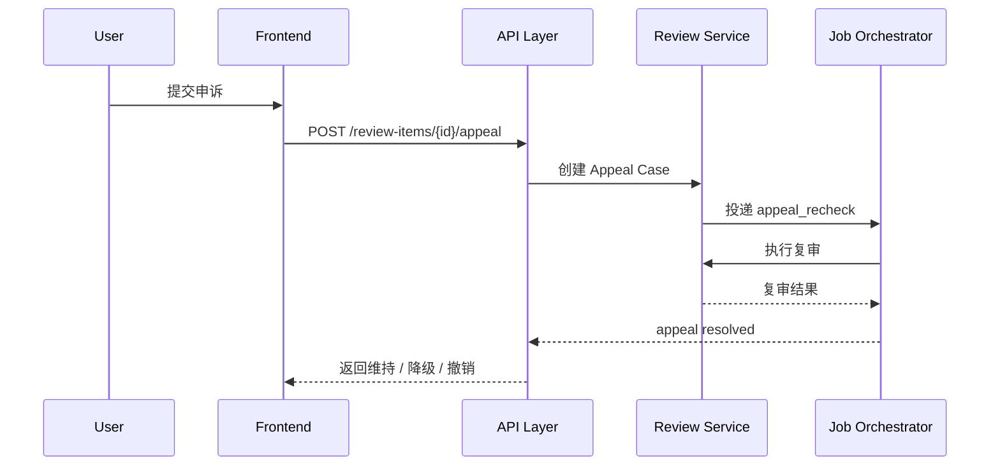
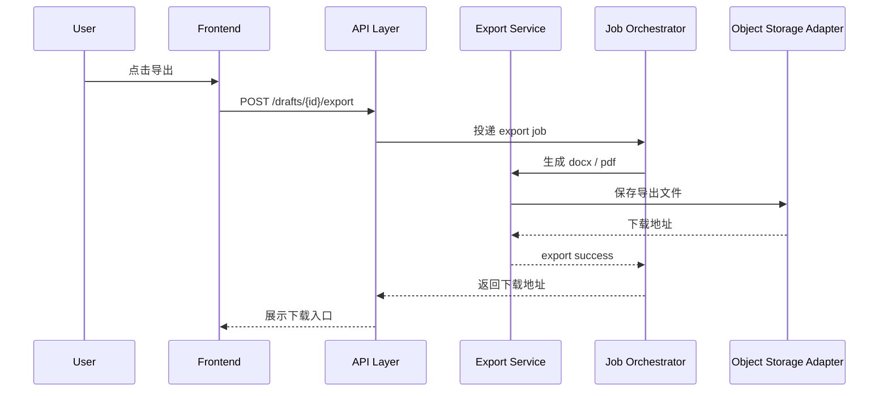
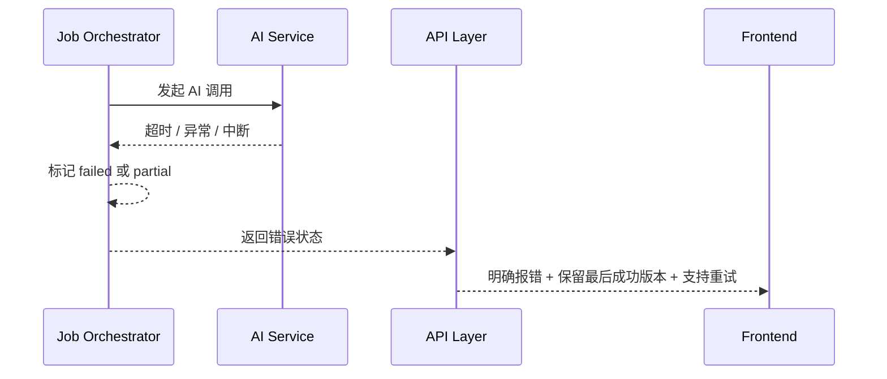

# AI 论文共写工作台 v1 后端服务拆分与状态机时序图

## 1. 文档目标

本文档用于补齐后端实现层的两类关键设计：

- `服务拆分`
  明确每个服务负责什么、输入输出是什么、边界在哪里
- `状态机与时序图`
  明确核心异步链路、失败路径、可恢复路径和关键状态流转

默认以以下文档为上位基线：

- [PRD.md](../product/PRD.md)
- [api_field_spec.md](api_field_spec.md)
- [postgresql_schema.sql](../../postgresql_schema.sql)

---

## 2. 后端架构目标

v1 后端目标不是搭一个复杂的微服务系统，而是保证以下几点：

- 上传到生成的主链路可用
- AI 任务全部异步化，可重试
- 关键材料未完成 AI 语义解析时不得生成
- 材料不足时明确阻断生成
- 任意失败都可恢复，不污染已有版本

建议的实现方式：

- `API Gateway / BFF`
- `业务服务层`
- `异步任务队列`
- `对象存储`
- `PostgreSQL`
- `AI 编排层`

---

## 3. 服务拆分总览

建议按能力拆成 9 个核心服务：

1. `Workspace Service`
2. `Material Service`
3. `Preprocess Service`
4. `AI Semantic Parse Service`
5. `Requirement Service`
6. `Sufficiency Service`
7. `Draft Service`
8. `Review Service`
9. `Export Service`

另配两个基础设施层：

10. `Job Orchestrator`
11. `Object Storage Adapter`

---

## 4. 服务定义

## 4.1 Workspace Service

### 职责
- 创建项目
- 获取项目列表
- 获取项目详情
- 更新项目基础信息
- 维护当前版本指针
- 维护项目整体状态

### 输入
- 用户身份
- 项目标题
- 当前项目上下文

### 输出
- `workspace`
- `currentDraftVersionId`
- `status`

### 不负责
- 文件处理
- AI 调用
- 导出

---

## 4.2 Material Service

### 职责
- 接收上传输入
- 写入对象存储
- 创建 `materials` 记录
- 标记是否关键材料
- 触发预处理任务
- 接收补传与补充说明

### 输入
- 文件流
- 粘贴文本
- 外部链接
- 来源类型
- 是否关键材料

### 输出
- `materialId`
- `rawFileUrl`
- `parseStage`

### 不负责
- OCR
- 语义分类
- 生成草稿

---

## 4.3 Preprocess Service

### 职责
- 文件读取
- 基础 OCR
- 文本抽取
- 页数拆分
- 图片 / 表格切片
- 写入 `preprocessed_contents`

### 输入
- `materialId`
- 原始文件地址

### 输出
- `preprocessedContent`
- `parseStage = preprocessed`

### 不负责
- 判断材料属于什么
- 判断是否可支撑论文

---

## 4.4 AI Semantic Parse Service

### 职责
- AI 语义理解
- 材料分类
- 提取摘要
- 识别要求 / 论点 / 证据
- 判断与当前论文主题的关系
- 写入 `ai_semantic_parse_results`

### 输入
- `materialId`
- `preprocessedContent`
- 当前项目主题上下文

### 输出
- `materialCategory`
- `summary`
- `detectedClaims`
- `detectedEvidence`
- `detectedRequirements`
- `parseStage = ai_parsed | ai_partial | ai_failed`

### 特别规则
- 若关键材料 `ai_partial` 或 `ai_failed`，不得直接进入生成
- 低置信度内容必须显式落库

---

## 4.5 Requirement Service

### 职责
- 从 AI 解析结果中抽取老师要求
- 合并多份要求来源
- 检测冲突
- 检测最小关键字段是否缺失
- 生成并版本化 `RequirementSnapshot`

### 输入
- 多份 `ai_semantic_parse_results`
- 用户手动补充要求

### 输出
- `RequirementSnapshot`
- 冲突信息
- 缺失信息

### 不负责
- 判断材料总量是否够
- 生成正文

---

## 4.6 Sufficiency Service

### 职责
- 判断当前材料是否足以支撑生成
- 给出缺失项
- 给出补充建议与数量
- 输出 `MaterialSufficiencyResult`

### 输入
- Requirement Snapshot
- 已完成 AI 语义解析的材料集合
- 当前已识别的论点 / 证据 / 研究成果

### 输出
- `isGenerationEligible`
- `missingItems`
- `recommendedSupplements`

### 核心规则
- 材料不足时禁止生成
- 不允许通用知识兜底

---

## 4.7 Draft Service

### 职责
- 生成题目建议
- 生成全文框架
- 生成段落骨架
- 生成可编辑初稿
- 保存新版本
- 处理共写动作

### 输入
- Requirement Snapshot
- 可用材料
- 共写指令
- 可选目标范围

### 输出
- `DraftVersion`
- `generationStatus`

### 子能力
- `draft_generate`
- `rewrite_selection`
- `add_evidence`
- `adjust_structure`
- `reduce_repetition`
- `improve_expression`

---

## 4.8 Review Service

### 职责
- 生成推荐任务
- 输出审查项
- 按影响范围分级：
  - `notice`
  - `local_fix`
  - `must_confirm`
- 处理申诉与复审

### 输入
- Draft Version
- Requirement Snapshot
- Evidence Binding
- 用户申诉

### 输出
- `review_items`
- `appeal_cases`
- 复审结论

### 特别规则
- 评审不是终审
- 用户保留最终确认权

---

## 4.9 Export Service

### 职责
- 导出 docx
- 导出 pdf
- 导出带批注版本

### 输入
- Draft Version
- 导出参数

### 输出
- 导出任务
- 下载地址

---

## 4.10 Job Orchestrator

### 职责
- 异步任务编排
- 状态更新
- 重试
- 超时控制
- 错误落库

### 管理任务
- `semantic_parse`
- `requirement_extract`
- `material_sufficiency_eval`
- `draft_generate`
- `outline_refine`
- `evidence_bind`
- `review_pass`
- `appeal_recheck`
- `export_docx`
- `export_pdf`

### 特别规则
- 失败不污染已有成功版本
- 部分成功必须显式标记

---

## 4.11 Object Storage Adapter

### 职责
- 原始文件上传
- 预览文件读写
- 导出文件存储
- 文件权限控制

### 不负责
- 业务判断
- 状态编排

---

## 5. 服务依赖关系

```text
Client
  -> API Layer
    -> Workspace Service
    -> Material Service
    -> Draft Service
    -> Review Service
    -> Export Service

Material Service
  -> Object Storage Adapter
  -> Job Orchestrator

Job Orchestrator
  -> Preprocess Service
  -> AI Semantic Parse Service
  -> Requirement Service
  -> Sufficiency Service
  -> Draft Service
  -> Review Service
  -> Export Service
```

---

## 6. 核心状态机

## 6.1 Material 状态机

状态：

- `uploaded`
- `preprocessed`
- `ai_parsed`
- `ai_partial`
- `ai_failed`

状态流转：

```text
uploaded -> preprocessed
preprocessed -> ai_parsed
preprocessed -> ai_partial
preprocessed -> ai_failed
ai_partial -> ai_parsed
ai_failed -> preprocessed (retry path)
```

规则：
- `ai_partial` 可进入补全流程
- `ai_failed` 必须重试或补充
- 关键材料非 `ai_parsed` 时不可触发生成

---

## 6.2 Workspace 状态机

状态：

- `draft`
- `processing`
- `ready`
- `blocked`
- `archived`

状态流转：

```text
draft -> processing
processing -> blocked
processing -> ready
blocked -> processing
ready -> processing
ready -> archived
```

触发条件：
- 上传材料后：`draft -> processing`
- 材料不足：`processing -> blocked`
- 成功生成可用初稿：`processing -> ready`
- 补充材料再次尝试：`blocked -> processing`

---

## 6.3 Draft 生成状态机

状态：

- `queued`
- `running`
- `success`
- `partial`
- `failed`
- `blocked_insufficient_material`

状态流转：

```text
queued -> running
running -> success
running -> partial
running -> failed
queued -> blocked_insufficient_material
partial -> running (retry path)
failed -> queued (retry path)
```

规则：
- 只有材料充足检查通过，才能进入 `queued`
- `partial` 不可伪装为完整成功

---

## 6.4 Review 状态机

状态：

- `notice`
- `local_fix`
- `must_confirm`
- `appealed`
- `resolved`

状态流转：

```text
notice -> appealed
local_fix -> appealed
must_confirm -> appealed
appealed -> resolved
```

复审后的可能结果：
- 维持原等级
- 降级
- 撤销

---

## 7. 关键时序图

## 7.1 上传到生成主链路



---

## 7.2 解析补全链路



---

## 7.3 材料不足阻断链路



---

## 7.4 共写迭代链路



---

## 7.5 申诉复审链路



---

## 7.6 导出链路



---

## 8. AI 调用失败时序图



规则：
- 不允许本地伪生成
- 不允许把失败解释成成功

---

## 9. 服务间输入输出边界

## 9.1 Material Service -> Preprocess Service

输入：
- `materialId`
- `rawFileUrl`
- `fileType`

输出：
- `plainText`
- `ocrText`
- `pageMap`
- `imageSlices`

## 9.2 Preprocess Service -> AI Semantic Parse Service

输入：
- `materialId`
- `plainText`
- `ocrText`
- `imageSlices`
- `workspaceContext`

输出：
- `materialCategory`
- `summary`
- `claims`
- `evidence`
- `requirements`
- `confidenceScore`

## 9.3 Requirement Service -> Sufficiency Service

输入：
- `RequirementSnapshot`
- 已解析材料清单

输出：
- `isGenerationEligible`
- `missingItems`
- `recommendedSupplements`

## 9.4 Draft Service -> Review Service

输入：
- Draft Version
- Requirement Snapshot
- Evidence Bindings

输出：
- Review Items

---

## 10. 后端实现优先级

## 第一优先级
- Workspace Service
- Material Service
- Preprocess Service
- AI Semantic Parse Service
- Sufficiency Service

目标：
- 能完成上传 -> 解析 -> 拦截 / 生成决策

## 第二优先级
- Draft Service
- Job Orchestrator

目标：
- 能生成初稿并保存版本

## 第三优先级
- Review Service
- Appeal 流程

目标：
- 能给出推荐任务与审查项
- 能处理误判申诉

## 第四优先级
- Export Service
- 完整错误兜底
- 监控告警

---

## 11. 监控与告警建议

建议监控以下指标：

- 上传成功率
- 预处理失败率
- AI 解析失败率
- 材料不足拦截率
- 初稿生成成功率
- 共写成功率
- 审查项数量分布
- 申诉率
- 导出成功率
- AI 平均响应时间

建议告警：

- AI 解析失败率持续升高
- 初稿生成任务大量超时
- 导出失败率异常
- 关键任务队列堆积

---

## 12. 后端验收重点

- 关键材料非 `ai_parsed` 时，系统不得生成初稿
- 材料不足时，系统必须明确阻断并给出补充建议
- 任意 AI 失败不得污染已有 Draft Version
- 共写生成必须产生新版本，而不是覆盖旧版本
- 申诉复审链路必须可追溯
- 导出文件必须与指定 Draft Version 一致
